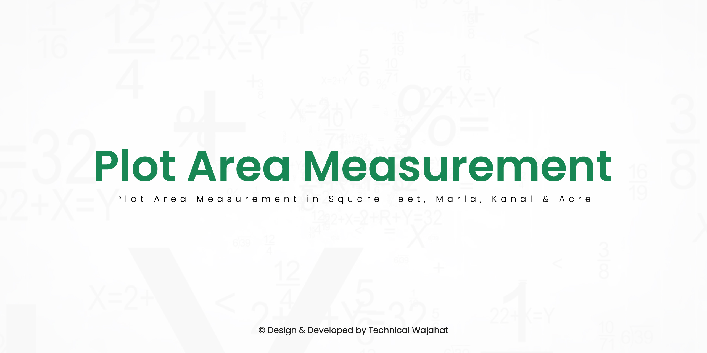

# Plot Area Measurement
*Plot Area Measurement in Square Feet, Marla, Kanal, and Acre - Heron's Formula has been used to find out the area in square feet, but you will find out the area in marla, kanal, and acre.*

## About this project
- **Design & Developed by:** [Muhammad Wajahat Asif aka Technical Wajahat](https://facebook.com/TechnicalWajahat)
- **Site Link:** [Plot Area Measurement in Square Feet, Marla, Kanal and Acre](https://technicalwajahat.github.io/plotmeasure/)

## Languages and Tools
- HTML
- CSS
- JavaScript
- Bootstrap

## Preview
